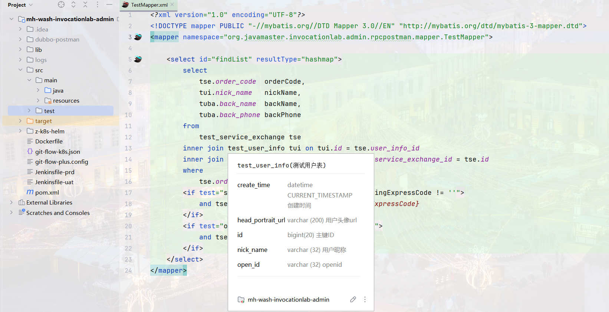
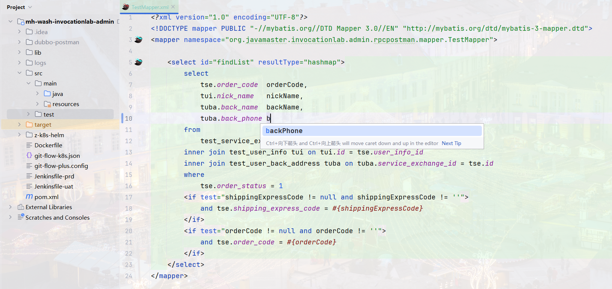
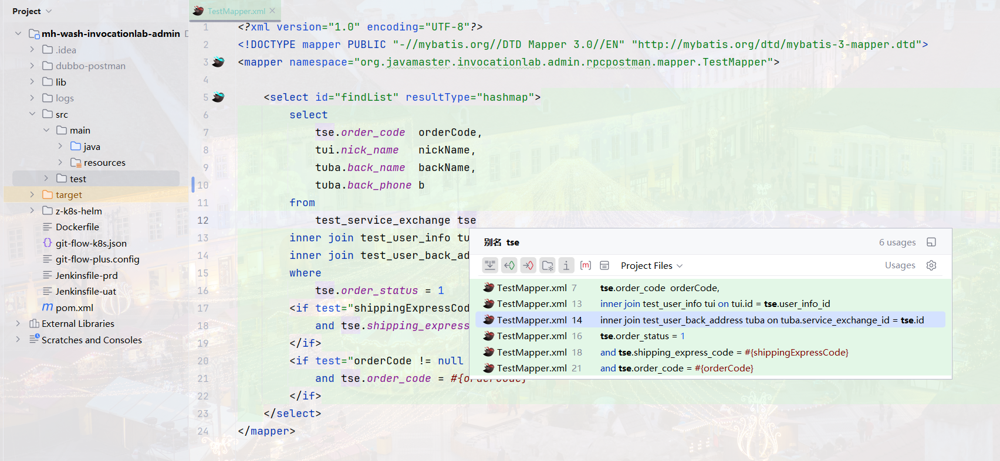
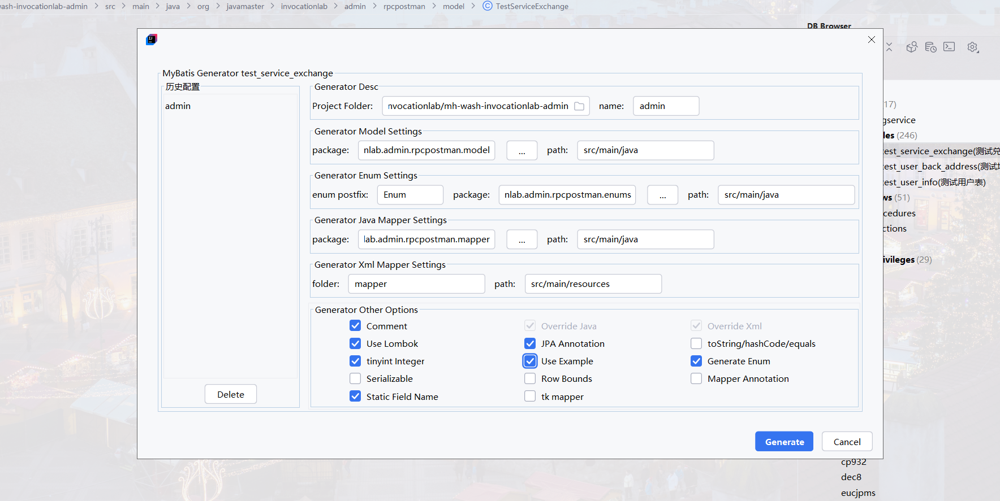

# DataBaseManager introduction
Fork code from [Database Navigator](https://plugins.jetbrains.com/plugin/1800-database-navigator) 

## DataBaseManager is a Database development, scripting and navigation tool
This software solution enhances the capabilities of the IntelliJ IDEA development environment and its associated products by providing comprehensive features for database development and maintenance.
It includes a robust SQL and PL/SQL editor that adheres to the IDE standards, along with advanced functionality for managing database connections, executing scripts, browsing database objects, editing data and code, supporting database compiler operations, executing and debugging methods, and facilitating the creation of database objects.
Additionally, it offers diverse navigation capabilities that seamlessly integrate across all its components, providing a powerful toolset for efficient and effective database development and management.

### Supported Databases:
- Oracle
- MySQL
- SQLite
- PostgreSQL
- Any JDBC compliant database (EXPERIMENTAL)

# DataBaseManager 介绍

## DataBaseManager是一个数据库开发、脚本编写和导航工具
通过为数据库开发和维护提供全面的功能，增强了IntelliJ IDEA开发环境及其相关产品的能力。它包括一个符合IDE标准的强大的SQL和PL/SQL编辑器，
以及用于管理数据库连接、执行脚本、浏览数据库对象、编辑数据和代码、支持数据库编译器操作、执行和调试方法以及促进数据库对象创建的高级功能。
此外，它还提供了多种导航功能，可无缝集成其所有组件，为高效和有效的数据库开发和管理提供了强大的工具集。

### 支持数据库:
- Oracle
- MySQL
- SQLite
- PostgreSQL
- 任何兼容jdbc的数据库 (实验性质)

### 主要功能如下：
- 支持 MyBatis mapper.xml 文件的 SQL 识别
- 支持提取控制台 MyBatis 打印的 SQL
- 集成 MyBatis Generator
- MyBatis Generator 支持动态 plugin 功能
- 支持悬浮展示表元数据信息
- 支持悬浮展示列元数据信息
- 支持输入表名时智能提示
- 支持输入列名时智能提示
- SQL 结构的跳转等

##### 悬浮提示表元数据信息

##### 悬浮提示列元数据信息

##### 表名输入智能提示

##### 列名输入智能提示

##### 列别名输入智能提示

##### SQL 引用及跳转

##### 提取 MyBatis 控制台 SQL

##### MyBatis Generator 配置页

##### MyBatis Generator 入口

##### MyBatis Generator 生成表时相关配置

##### MyBatis Generator 生成表相关 MyBatis 类及文件

##### MyBatis Generator custom plugin 入口

##### MyBatis Generator custom plugin 


## 作者信息
- 作者博客：[知乎](https://www.zhihu.com/people/liang-yu-dong-44)
- 作者邮箱：375709770@qq.com
- github 地址：https://github.com/jufeng98
- 
## 捐赠
如果项目帮到了您，请作者喝杯咖啡吧！


## 技术支持
微信记得备注 ```DataBaseManager```，共同进步。


